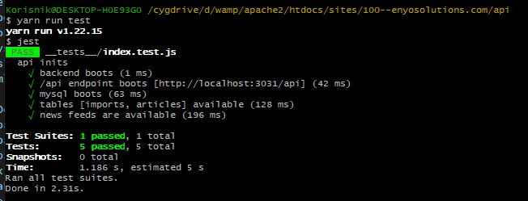

# welcome, demo-app

-- https://demo-enyosolutions.herokuapp.com/api

## api
  
  -- `GET   /api/articles                     # read posts`
  -- `POST  /api/articles/import/?siteRssUrl  # fetch new posts`

## install packages

`$ yarn install`

## run dev server

`$ yarn run dev`

## run tests

`$ yarn run test`

## setup database

run `/src/schema.sql`

## demo app 
  https://demo-app-enyosolutions.herokuapp.com/
